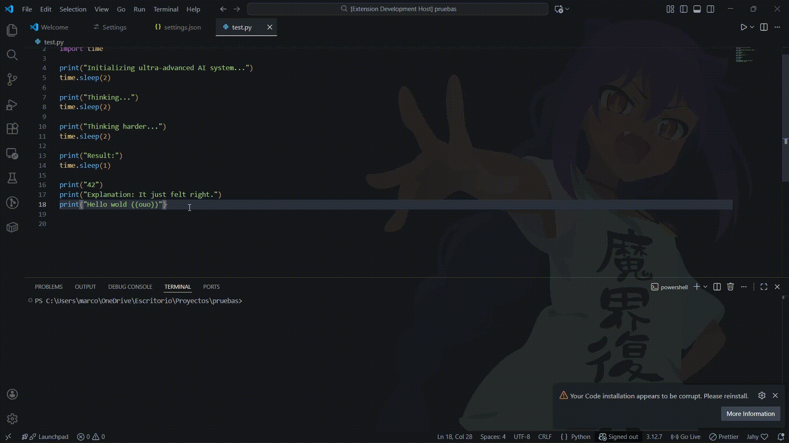
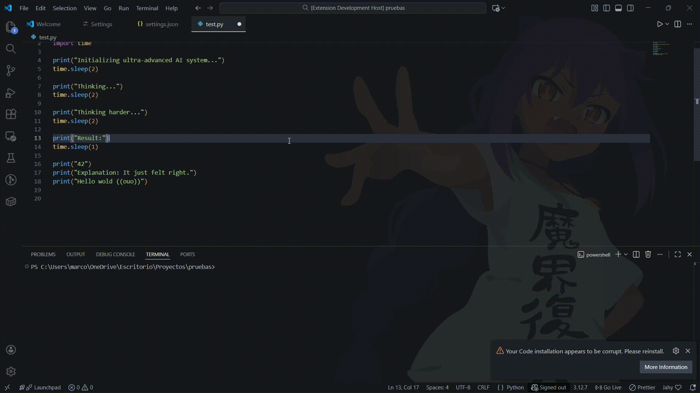

# VisualSGIFs

VisualSGIFs allows you to use GIFs in your work environment while programming. Several events are triggered that cause a GIF to appear above and to the right of the cursor.

## Requirements

Make sure you have the GIFs folder set up correctly

#### Folder Structure & Organization

VisualSGIFs uses a smart hierarchy that allows you to organize your GIFs by Series and Characters.

1. File Naming (Mandatory)
    Files must start with the mood tag followed by an underscore _.

   - ✅ `happy_01.gif`

   - ✅ `error_computer_smash.gif`

   - ❌ `my_happy_gif.gif` (Won't work because "my" is not a configured tag)

2. Folder Hierarchy
    You can organize your GIFs into three levels:
    1. Root Folder: GIFs placed here are ALWAYS active. Use this for generic memes or mixed reactions.

    2. Series Folders (Sub-folders): Folders inside the root represent specific Anime or TV Series (e.g., k-on, LoveLive). These must be activated in the settings to work.

    3. Character Folders (Sub-sub-folders): You can further organize inside a Series folder (e.g., k-on/yui/). The extension scans recursively, so if you activate the series k-on, it automatically includes GIFs inside yui.

3. Activating Series
    To enable specific sub-folders (series), go to Extension Settings > Active Series and add the folder names. 
    Example: ["k-on", "LoveLive"]

4. Example Structure

```
C:/MyGifs/                   <-- Root Folder (Configured in settings)
 │
 ├── error_generic.gif       <-- ALWAYS ACTIVE (Global)
 ├── test_01.gif             <-- ALWAYS ACTIVE (Global)
 │
 ├── k-on/                   <-- SERIES FOLDER
 │    │                      (Only active if "k-on" is added to 'Active Series' setting)
 │    │
 │    ├── happy_band.gif     <-- Active when "k-on" is enabled
 │    │
 │    └── yui/               <-- CHARACTER FOLDER (Organizational)
 │         └── cry_yui.gif   <-- Active when "k-on" is enabled
 │
 └── LoveLive/                 <-- SERIES FOLDER
      └── ...                
```

## Features

Describe specific features of your extension including screenshots of your extension in action. Image paths are relative to this README file.

Smart Error Detection: Reacts to syntax errors (red squigglies) by showing "sad" or "angry" GIFs.



AFK Mode: Shows a "sleeping" or "bored" GIF when you haven't typed or moved the mouse for a set time.



## Extension Settings

This extension contributes the following settings:

#### General

* `visualsgifs.gifFolderPath`: (Required) Absolute path to your GIF collection.
* `visualsgifs.activeSeries`: List of sub-folders to include (recursive search).

#### Events (Enable/Disable)

* `visualsgifs.events.enableError`: Enable GIFs on syntax errors. (Default: true)
* `visualsgifs.events.enableAfk`: Enable GIFs on inactivity. (Default: true)
* `visualsgifs.events.enableSuccess`: Enable GIFs on successful execution. (Default: true)

#### Timers & Sensitivity

* `visualsgifs.error.debounceTime`: Milliseconds to wait before showing an error GIF. Prevents flashing while typing.
* `visualsgifs.afk.timeInMinutes`: Minutes of inactivity before triggering AFK mode.
* `visualsgifs.display.durationSeconds`: How long the GIF stays on screen.

#### Display

* `visualsgifs.display.maxWidth`: Max width of the GIF in pixels.
* `visualsgifs.display.maxHeight`: Max height of the GIF in pixels.

#### Custom Tags

You can customize the keywords used to search for GIFs:

* `visualsgifs.tags.error`: Default: ["angry", "cry", "pout", "error"]
* `visualsgifs.tags.success`: Default: ["happy", "dance", "celebrate", "success"]
* `visualsgifs.tags.afk`: Default: ["sleeping", "bored", "afk"]
* `visualsgifs.tags.test`: Default: ["happy", "test", "wag"]
